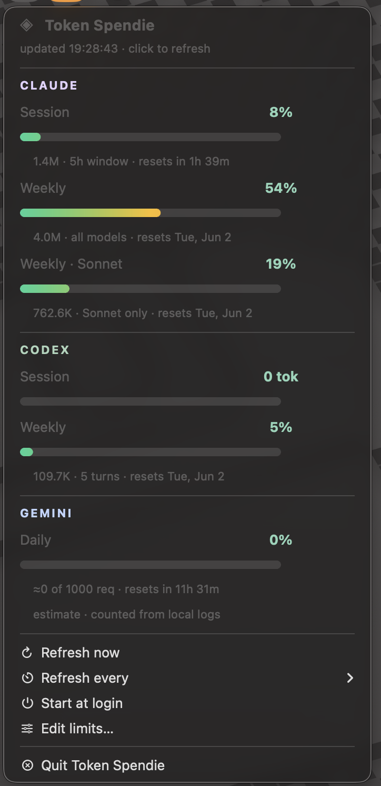

# Token Spendie

macOS menu-bar widget ที่ monitor การใช้ **token** ของ **Claude**, **Codex** และ **Gemini**
โดยอ่านจาก log ในเครื่อง — **ไม่เรียก API ไม่เปลือง token** (0 token ต่อการ refresh)

<p align="center">
  
</p>

---

## Features

- **Claude** — Session (5h) / Weekly (all models) / Weekly · Sonnet — จาก `~/.claude/projects/**/*.jsonl`
- **Codex** — Session (5h) / Weekly + จำนวน turns — จาก `~/.codex/log/codex-tui.log`
- **Gemini** — Daily requests — จาก `~/.gemini/tmp/gemini-cli/`
- **UI โมเดิร์น** — progress bar ไล่สี (เขียว→เหลือง→แดง) โค้งมน, ตัวเลข % สีตามสถานะ,
  section header ไล่ letter-spacing, ปุ่มล่างใช้ SF Symbols — ไม่มี emoji ดอทกลม
- เลือก refresh interval ได้ (1 / 2 / 5 / 10 / 15 / 30 / 60 นาที)
- Start at login (toggle ได้ผ่าน LaunchAgent)
- ปรับ limit ของแต่ละค่ายได้
- Quit แล้ว kill process จริง
- เป็น **menu-bar-only** (ไม่มี Dock icon ขณะรัน)

## Build & Install

```bash
git clone https://github.com/poey-drp/token-spendie.git
cd token-spendie
./build_app.sh
open "Token Spendie.app"
```

`build_app.sh` จะ:
1. ติดตั้ง dependencies (`rumps`, `Pillow`)
2. generate icon (`make_icons.py`)
3. แพ็กเป็น `Token Spendie.app` แบบ self-contained

จากนั้นดับเบิลคลิก หรือลากไปไว้ใน **Applications / Dock / Desktop** แล้วมองหาไอคอน **◈** บน menu bar

> แก้โค้ดแล้วต้องรัน `./build_app.sh` ใหม่ทุกครั้ง
> รันแบบ dev (ไม่ผ่าน bundle): `./run.sh`

## การตั้งค่า

- **Refresh every** — เลือกความถี่ (บันทึกลง config อัตโนมัติ)
- **Start at login** — toggle auto-start (LaunchAgent `~/Library/LaunchAgents/com.tokenspendie.agent.plist`)
- **Edit limits…** — แก้ limit ที่ `~/.config/token_spendie/config.json` (กด Refresh now ไม่ต้อง restart)

## ความแม่นยำของตัวเลข

- **ตัวเลขจริงอยู่บนเซิร์ฟเวอร์เท่านั้น** — Claude `/status` ดึงสด widget เป็นการ **ประมาณจาก log ในเครื่อง**
  (ไม่รวม device อื่น หรือ claude.ai)
- **นับเฉพาะ fresh tokens** — ตัด cache read ออก (ไม่งั้น cache read จะกินยอด ~97% ทำให้ % พองเกินจริง)
- **Limit ถูก calibrate กับ /status** (session 7% / week 52% ณ 2026-05-26)
  - อยาก calibrate ใหม่: อ่าน `/status` → ตั้ง `limit = ยอดที่ widget นับได้ ÷ (% จาก /status)` ในเมนู Edit limits
- **ChatGPT desktop app อ่านไม่ได้** — เข้ารหัส local storage ทั้งหมด ดู token จริงที่ platform.openai.com/usage

## โครงสร้างไฟล์

| ไฟล์ | หน้าที่ |
|------|--------|
| `token_spendie.py` | แอปหลัก (อ่าน log + rumps menu + styling) |
| `build_app.sh` | สร้าง `Token Spendie.app` |
| `make_icons.py` | generate `menubar_icon.png` + `AppIcon.icns` |
| `run.sh` | รันแบบ dev |
| `requirements.txt` | `rumps`, `Pillow` |

## Requirements

- macOS 11+ (Apple Silicon หรือ Intel)
- Python 3.10+ (แนะนำ framework / GUI python เพื่อให้ menu-bar icon แสดง — `build_app.sh` เลือกให้อัตโนมัติ)

## License

[MIT](LICENSE) © 2026 Poey
